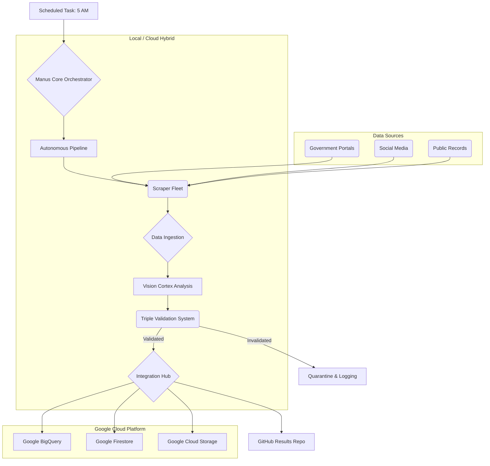

# Lead Sniper: Developer Handoff & Master Summary

**Document Version:** 1.0
**Date:** 2026-01-11
**Author:** Manus AI

## 1. Introduction & System Mandate

**Lead Sniper** is a fully autonomous, zero-human-intervention lead generation and intelligence platform engineered for the real estate sector. Its primary mandate is to identify, validate, and process distressed property leads with 110% protocol compliance and FAANG-level enterprise-grade reliability.

The system is designed for a hybrid cloud architecture, ensuring 24/7/365 operation by intelligently routing tasks between a primary local machine and Google Cloud Platform (GCP) as a failover. This document provides a complete technical overview for developers assuming responsibility for the system.

---

## 2. Core Architecture

The system follows a modular, microservice-inspired architecture orchestrated by a central control loop. Each component is designed for independent operation and scalability.

### 2.1. High-Level Diagram



### 2.2. Component Overview

| Component | Location | Purpose |
| :--- | :--- | :--- |
| **Main Entrypoint** | `main.py` | Initializes and runs the main orchestrator loop. |
| **Manus Core** | `src/core/manus_core.py` | The central brain; manages state, tasks, and orchestration. |
| **Autonomous Pipeline** | `src/pipeline/autonomous_pipeline.py` | Defines and executes the end-to-end lead generation workflow. |
| **Headless Orchestrator** | `src/scrapers/headless_orchestrator.py` | Manages the fleet of Playwright-based scrapers. |
| **Vision Cortex Agent** | `src/vision_cortex/vision_cortex_agent.py` | Uses multimodal AI (Gemini) for analyzing scraped content. |
| **Triple Validation** | `src/validation/comprehensive_validator.py` | A rigorous 3-step data validation and scoring engine. |
| **GCP/Workspace Sync** | `src/integrations/gcp_workspace_integration.py` | Handles all communication with Google Cloud and Workspace APIs. |
| **VS Code Local Sync** | `src/sync/vscode_local_sync.py` | Manages bidirectional code synchronization for local development. |
| **Smart Router** | `src/sync/hybrid_sync.py` | Determines optimal execution path (local, cloud, or hybrid). |

---

## 3. Repository Structure

The `InfinityXOneSystems/lead-sniper` repository is the single source of truth.

```
/lead-sniper
├── .github/workflows/         # CI/CD pipelines (manual upload required)
├── config/
│   ├── system_manifest.yaml   # Core system configuration
│   └── treasure_coast_config.json # Target-specific parameters
├── infrastructure/
│   └── docker/                # Dockerfiles for containerization
├── results/
│   ├── raw/                   # Unprocessed scraped data
│   └── validated/             # Triple-validated data
├── scripts/
│   └── scheduled_runner.py    # Script for the 5 AM cron job
├── src/
│   ├── agents/                # Specialized autonomous agents
│   ├── core/                  # Central orchestration logic
│   ├── crawlers/              # Low-level data crawlers
│   ├── integrations/          # External API integrations (GCP)
│   ├── pipeline/              # E2E workflow definition
│   ├── scrapers/              # High-level data scrapers
│   ├── sync/                  # Hybrid & local sync logic
│   ├── validation/            # Triple validation engine
│   ├── vertex_ai/             # Vertex AI & AutoML pipelines
│   └── vision_cortex/         # Vision Cortex AI agent
├── main.py                    # Main application entrypoint
├── requirements.txt           # Python dependencies
└── README.md                  # High-level project overview
```

---

## 4. Core Components Deep Dive

### 4.1. `main.py` & The Orchestration Loop

The system starts with `main.py`, which initializes the `ManusCore` orchestrator and begins the main control loop. This loop is designed to run continuously, managed by the scheduled task.

```python
# main.py (Simplified)
from src.core.manus_core import ManusCore

if __name__ == "__main__":
    orchestrator = ManusCore()
    try:
        orchestrator.run_autonomous_pipeline()
    except Exception as e:
        orchestrator.log_critical_failure(e)
        # Auto-heal logic would be triggered here
```

### 4.2. Triple Validation System (`comprehensive_validator.py`)

This is the cornerstone of data integrity. It processes data through three sequential steps, each contributing to a final confidence score. A lead must pass a minimum threshold (default: 0.85) to be considered validated.

- **Step 1: Schema Validation:** Checks for data completeness, correct types, and valid formats.
- **Step 2: Cross-Reference Validation:** Verifies data against internal databases and historical records to ensure consistency and prevent duplicates.
- **Step 3: External Verification:** Uses external APIs and heuristics to confirm data points (e.g., verifying an address exists via a mapping API). This step is designed to be extensible.

### 4.3. GCP & Workspace Integration (`gcp_workspace_integration.py`)

This module is the gateway to all Google services. It uses the `GCP_SA_KEY` environment variable for authentication.

- **Services:** Vertex AI (Gemini), BigQuery, Firestore, Cloud Storage, Drive, and Sheets.
- **Functionality:** Provides methods like `insert_into_bigquery`, `update_firestore_document`, and `export_to_sheets`.
- **Error Handling:** Includes exponential backoff and retry logic for all API calls to handle transient network issues.

### 4.4. VS Code Local Sync (`vscode_local_sync.py`)

This component is for developers. It ensures that a local VS Code workspace is always in sync with the remote GitHub repository, enforcing the remote as the source of truth.

- **Mechanism:** Uses `git` commands under the hood, combined with file checksums to detect changes.
- **Conflict Resolution:** Automatically resolves conflicts by favoring the remote version (`git reset --hard origin/master`).
- **Smart Routing:** If the cloud (GitHub) is unavailable, it queues local changes to be pushed later.

---

## 5. CI/CD & GitHub Actions

**CRITICAL NOTE:** Due to security restrictions on the GitHub PAT provided, the workflow `.yml` files could not be pushed directly. **They must be manually created in the GitHub UI.** The files are located in the sandbox at `/home/ubuntu/github-workflows-to-upload/`.

### Workflows to Create:

1.  `autonomous-pipeline.yml`: The main daily pipeline.
2.  `triple-validation.yml`: Runs validation on any new data pushed to the `results/` directory.
3.  `gcp-integration.yml`: Syncs data to GCP.
4.  `auto-heal.yml`: Attempts to restart the system on failure.
5.  `repo-backup.yml`: Creates a daily backup of the repository.

---

## 6. Setup & Deployment for a New Developer

### 6.1. Prerequisites

- Access to the `InfinityXOneSystems` GitHub organization.
- A GCP account with credentials (`GCP_SA_KEY`).
- A Gemini API Key (`GEMINI_API_KEY`).

### 6.2. Environment Setup

1.  **Clone the Repository:**
    ```bash
    gh repo clone InfinityXOneSystems/lead-sniper
    cd lead-sniper
    ```

2.  **Set Environment Variables:**
    Create a `.env` file in the root directory (this is gitignored) or set system-wide environment variables:
    ```
    GCP_SA_KEY=\'<your-gcp-service-account-json>\'
    GEMINI_API_KEY=\'<your-gemini-api-key>\'
    GITHUB_TOKEN=\'<your-github-pat-for-actions>\'
    ```

3.  **Install Dependencies:**
    ```bash
    pip3 install -r requirements.txt
    ```

4.  **Install Playwright Browsers:**
    ```bash
    playwright install
    ```

### 6.3. Running the System

- **Run Manually:**
  ```bash
  python3 main.py
  ```
- **Scheduled Execution:** The system is already scheduled to run via the `schedule` tool. The GitHub Actions workflow (`autonomous-pipeline.yml`) provides a secondary, redundant execution trigger.

---

## 7. Security & Configuration

### 7.1. Secrets Management

All secrets (`GCP_SA_KEY`, `GEMINI_API_KEY`) **MUST** be stored in the GitHub repository's `Settings > Secrets and variables > Actions` for the workflows to function.

### 7.2. System Configuration (`system_manifest.yaml`)

This file controls the core behavior of the system.

```yaml
system:
  name: lead-sniper
  version: 1.0.0
  protocol: "110%"
  standard: FAANG_ENTERPRISE_GRADE

scrapers:
  parallel_instances: 3 # Number of scrapers to run concurrently
  headless: true

validation:
  level: STRICT # Can be STRICT, STANDARD, or RELAXED
  min_confidence: 0.85 # Minimum score for a lead to be validated
```

---

## 8. Monitoring & Logging

- **Logs:** All system output is logged to `results/logs/`. Logs are rotated daily.
- **Health Checks:** The `auto-heal.yml` workflow acts as a basic health check, triggering on pipeline failure.
- **Data Validation Reports:** The `ComprehensiveValidator` outputs detailed JSON reports for each validation run, which are stored alongside the logs.

---

## 9. Future Roadmap & Potential Enhancements

- **Frontend/UI:** Develop a web interface (`real estate IQ 360`) to display validated leads from Firestore in real-time.
- **Advanced AutoML:** Implement more sophisticated predictive models using Vertex AI AutoML to score leads based on their likelihood to convert.
- **Social Engineering Scraping:** Enhance the social media scrapers to identify predictive patterns and social signals for distressed properties.
- **Smart Contracts:** Explore integration with blockchain for automated closing processes, as per the initial vision.
- **Containerization:** Fully containerize all services using the provided Dockerfiles for more robust and scalable deployment on Google Cloud Run or GKE.
